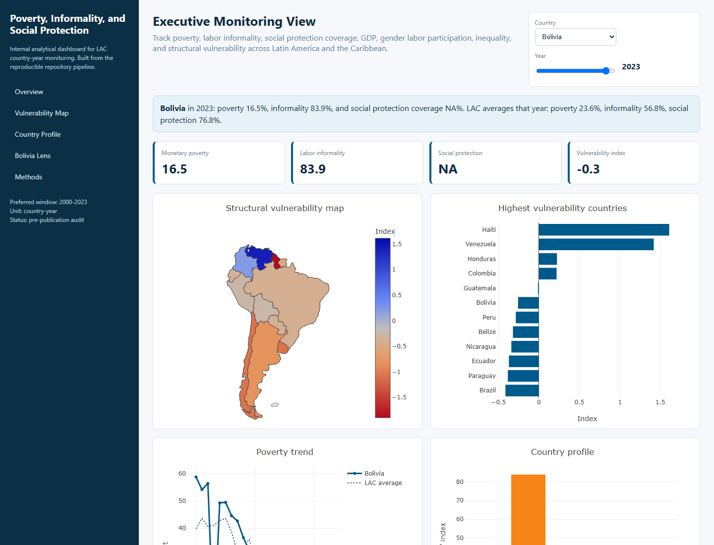
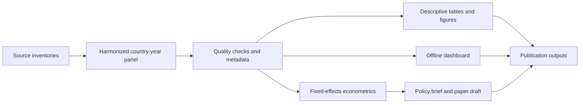
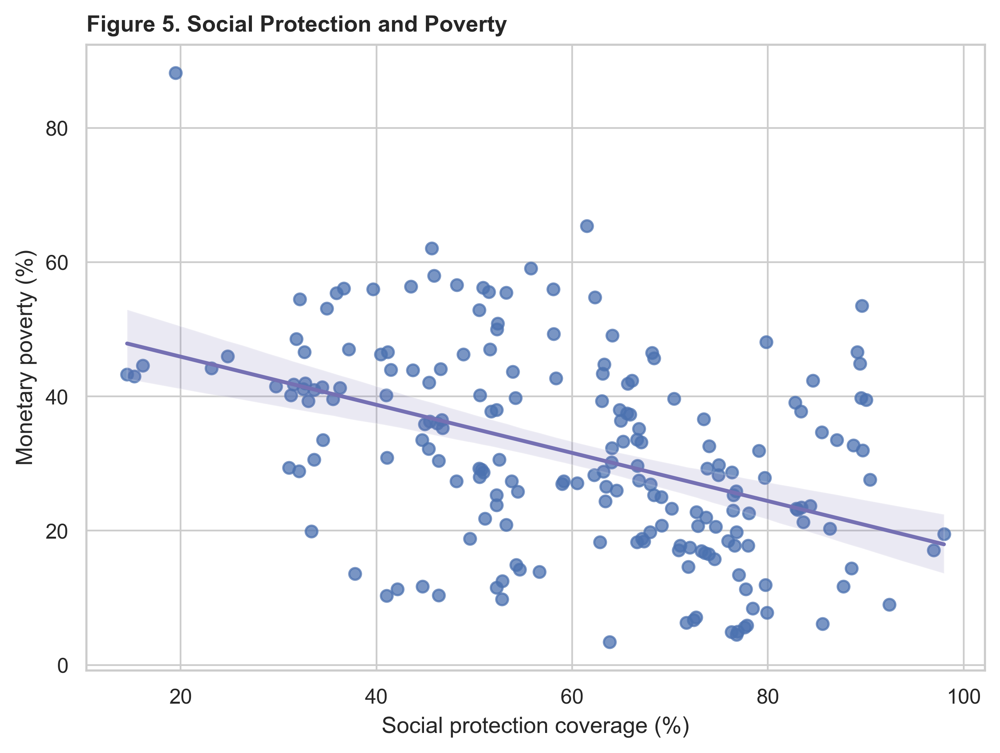
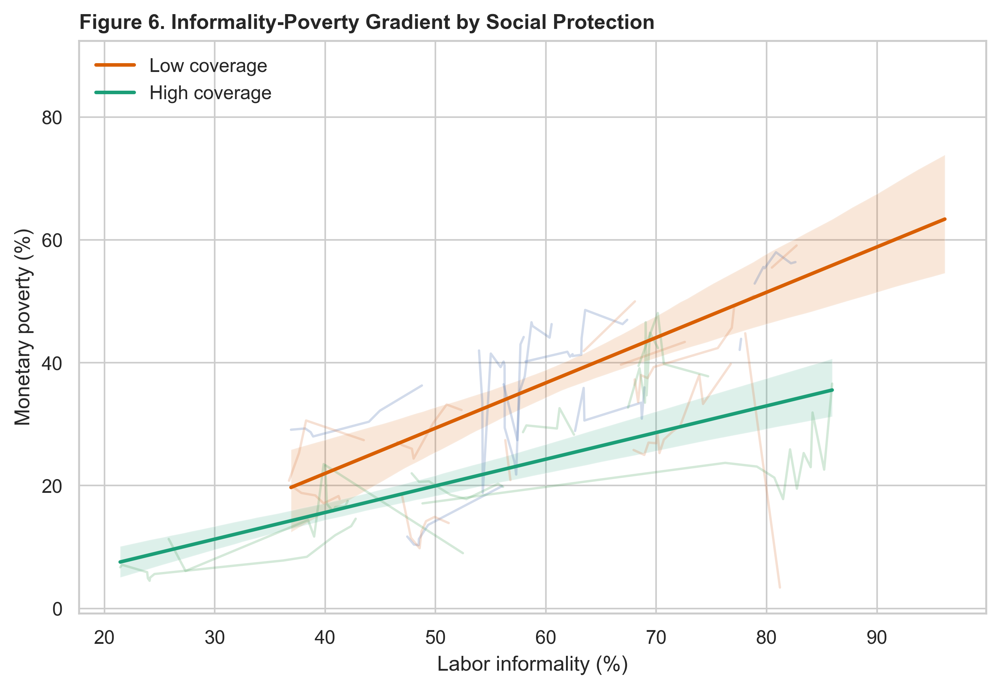
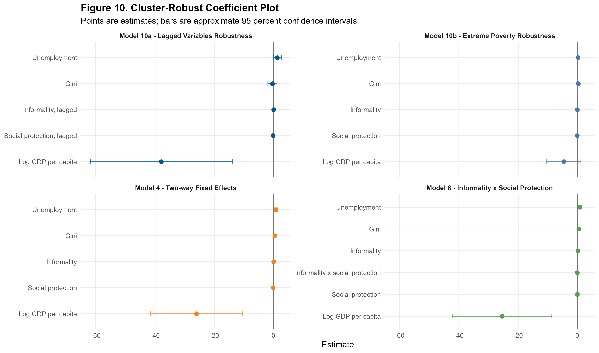

# Poverty, Informality, and Social Protection in Latin America


[](https://github.com/MonicaCT/poverty-informality-social-protection-lac/actions/workflows/ci.yml)


A professional applied economics portfolio repository studying the joint relationship between poverty, labor informality, and social protection in Latin America and the Caribbean, with a dedicated Bolivia lens. The repository combines a harmonized country-year panel, audited econometric models, publication figures, a policy brief, and an offline dashboard.

> Publication status: prepared for GitHub publication, but not yet published.

## Research Question

To what extent do labor informality and social protection jointly explain poverty dynamics in Latin America and the Caribbean?

The project is designed for reviewers who care about research credibility, reproducibility, and software engineering quality: development economists, policy institutions, data scientists, and GitHub portfolio reviewers.

## Executive Findings

- Harmonized panel: 1,789 country-year rows, 27 countries, 1946-2025.
- Preferred model sample: 178 complete observations, 17 country clusters, 2006-2023.
- Preferred estimator: country and year fixed effects with country-clustered robust standard errors.
- Social protection is negatively associated with poverty in the preferred model.
- Informality has the expected positive sign, but the clustered estimate is not robustly significant in the preferred specification.
- Dynamic GMM estimates are retained only as robustness checks because the weighting matrix is singular in this panel.

## Repository Highlights

| Component | What it provides |
|---|---|
| `data/processed/` | Publication-ready country-year panel used by the reproducible public workflow. |
| `data/metadata/` | Codebook, validation reports, source provenance, missingness, and build summaries. |
| `code/python/` | Data inventory, panel construction, descriptive analysis, dashboard, and document generation. |
| `code/r/` | Econometric models, robust inference, diagnostics, and model tables. |
| `outputs/figures/` | Twelve publication figures in PNG and PDF formats plus a figure catalog. |
| `outputs/models/` | Model outputs, clustered standard errors, diagnostics, VIFs, and GMM notes. |
| `dashboard/` | Self-contained offline dashboard with embedded Plotly and data. |
| `docs/` | GitHub Pages documentation for data lineage, methodology, dashboard, and reproducibility. |
| `.github/` | Issue templates, pull request template, CI, and manual Pages workflow. |

## Dashboard

The dashboard is generated from the processed panel and is available as a live GitHub Pages dashboard after Pages is enabled: [Open dashboard](https://monicact.github.io/poverty-informality-social-protection-lac/dashboard/). The offline source file is also available at [`dashboard/index.html`](dashboard/index.html).



## Methodology At A Glance



The preferred empirical strategy is a two-way fixed-effects panel model:

```text
poverty_it = beta1 informality_it + beta2 social_protection_it + beta3 X_it + country FE + year FE + error_it
```

Robustness checks include random effects, Hausman tests, lagged regressors, interaction models, regional heterogeneity, alternative outcomes, alternative informality definitions, and exploratory dynamic panel specifications.

## Figure Gallery

Every figure is generated by the reproducible analysis pipeline.

| Figure | Caption | Preview |
|---|---|---|
| Figure 1 | Evolution of monetary poverty |  |
| Figure 2 | Evolution of labor informality |  |
| Figure 3 | Social protection coverage |  |
| Figure 4 | Informality vs poverty |  |
| Figure 5 | Social protection vs poverty |  |
| Figure 6 | Informality-poverty gradient by protection coverage |  |
| Figure 7 | Regional vulnerability map |  |
| Figure 8 | Country-year poverty heatmap |  |
| Figure 9 | Country vulnerability ranking |  |
| Figure 10 | Cluster-robust coefficient plot |  |
| Figure 11 | Indicator distributions |  |
| Figure 12 | Bolivia vs Latin America |  |

## Quick Start On A Clean Computer

Clone the repository and install dependencies:

```bash
python -m venv .venv
source .venv/bin/activate  # Windows: .venv\Scripts\activate
python -m pip install --upgrade pip
python -m pip install -r requirements.txt
```

Install R packages:

```r
install.packages(c("readr", "dplyr", "plm", "fixest", "broom", "ggplot2", "openxlsx", "officer", "knitr", "lmtest", "sandwich", "car"))
```

Reproduce public outputs from the included processed panel:

```bash
python code/python/02_descriptive_analysis.py
python code/python/03_build_dashboard.py
Rscript code/r/03_econometric_models.R
python code/python/04_generate_documents.py
python tests/test_panel_integrity.py
python tests/test_repository_outputs.py
python tests/test_publication_readiness.py
```

Windows users can run the portable PowerShell workflow:

```powershell
./run_pipeline.ps1
```

The full raw-source rebuild is optional and requires local copies of the original data archives configured in [`config/project_sources.yml`](config/project_sources.yml):

```powershell
./run_pipeline.ps1 -FullRawRebuild
```

## Documentation

- [GitHub Pages index](docs/index.md)
- [Empirical strategy](docs/EMPIRICAL_STRATEGY.md)
- [Econometric diagnostics](docs/ECONOMETRIC_DIAGNOSTICS.md)
- [Data lineage](docs/DATA_LINEAGE.md)
- [Model limitations](docs/MODEL_LIMITATIONS.md)
- [Data license notes](docs/DATA_LICENSE.md)
- [Publication checklist](PUBLICATION_CHECKLIST.md)
- [Final repository review](FINAL_REPOSITORY_REVIEW.md)

## Key Outputs

- Processed panel: [`data/processed/lac_poverty_informality_social_protection_panel.csv`](data/processed/lac_poverty_informality_social_protection_panel.csv)
- Codebook: [`data/metadata/CODEBOOK.md`](data/metadata/CODEBOOK.md)
- Validation report: [`data/metadata/validation_report.md`](data/metadata/validation_report.md)
- Model results: [`outputs/models/model_results.md`](outputs/models/model_results.md)
- Diagnostics: [`outputs/models/econometric_diagnostics.md`](outputs/models/econometric_diagnostics.md)
- Policy brief: [`policy_brief/policy_brief.pdf`](policy_brief/policy_brief.pdf)
- Paper draft: [`paper/paper_draft.md`](paper/paper_draft.md)

## Reproducibility Contract

The public workflow does not require proprietary raw microdata. It starts from the included processed panel and regenerates figures, tables, dashboard assets, econometric outputs, and documents. The raw inventory and full rebuild scripts are retained for transparency and future private extensions.

Continuous integration verifies processed panel integrity, required research outputs, robust standard-error metadata, publication assets, README figure coverage, and relative links.

## Data And Licensing

Code is released under the MIT License. Source datasets remain governed by their original providers and are not relicensed by this repository. See [`docs/DATA_LICENSE.md`](docs/DATA_LICENSE.md) for details.

## Citation

If you use this repository, cite it using [`CITATION.cff`](CITATION.cff).

