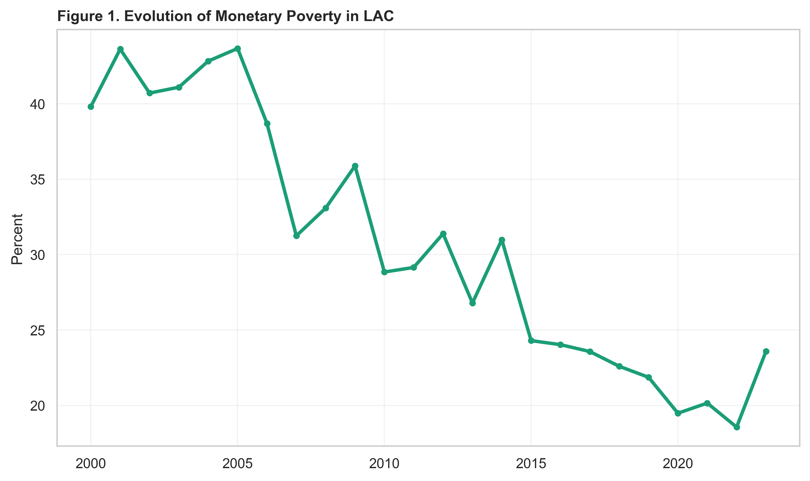
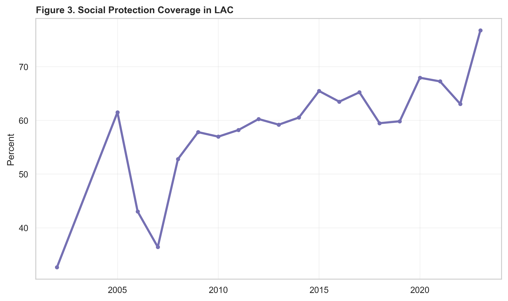
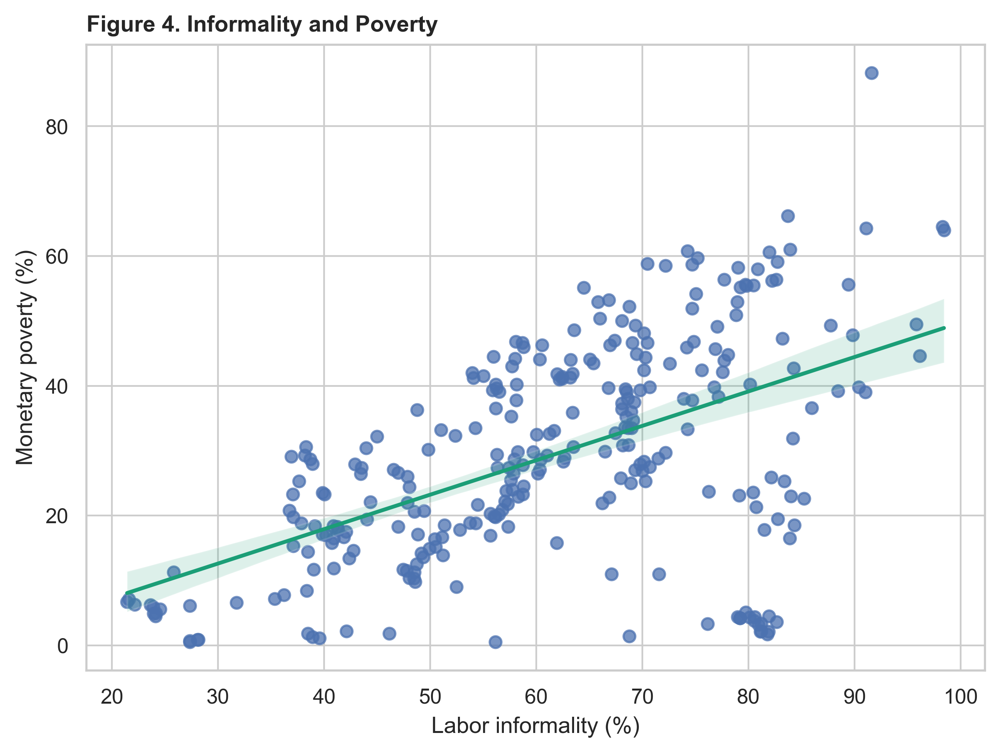
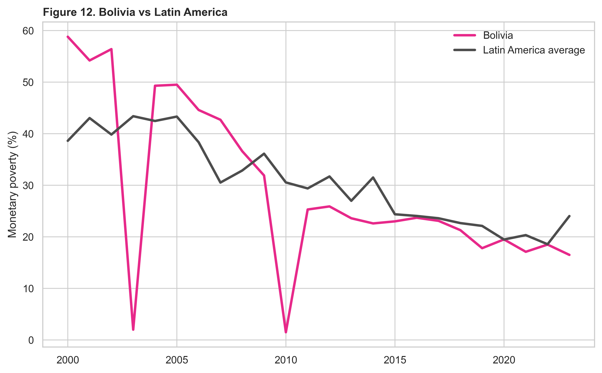

# Poverty, Informality and Social Protection in Latin America

**A reproducible panel-data framework for understanding poverty dynamics, labor informality and social-protection coverage across Latin America**


[](https://monicact.github.io/poverty-informality-social-protection-lac/)
[](https://monicact.github.io/poverty-informality-social-protection-lac/dashboard/)
[](https://monicact.github.io/poverty-informality-social-protection-lac/#figures)
[](https://monicact.github.io/poverty-informality-social-protection-lac/#tables)
[](https://monicact.github.io/poverty-informality-social-protection-lac/#methodology)
[](data/metadata/CODEBOOK.md)
[](https://github.com/MonicaCT/poverty-informality-social-protection-lac)
[](https://monicact.github.io/MonicaCT/)

## Data analyst capabilities demonstrated

- Python data processing;
- multi-source data integration;
- country-year panel construction;
- data-quality validation;
- missingness analysis;
- indicator engineering;
- interactive dashboard development;
- reproducible reporting;
- automated repository tests;
- policy-oriented data communication.

## Research question

How can harmonized country-year indicators be used to describe the relationships among poverty, labor informality, social-protection coverage and structural vulnerability across Latin America and the Caribbean?

The repository is designed as a descriptive and reproducible policy-analysis framework. It supports country comparison, dashboard exploration and cautious interpretation of regional patterns, without presenting the indicators as causal estimates.

## Why this matters

Poverty, informality and social protection are deeply connected in Latin America, but they are often discussed through separate data systems. This repository brings those indicators into a common panel structure and dashboard so policy audiences can inspect coverage, missingness, country patterns and Bolivia's position in a regional context. The project emphasizes transparent data lineage and descriptive interpretation rather than overclaiming causal effects from incomplete cross-country indicators.

## Key findings

- The harmonized panel contains 1,789 country-year rows, 27 countries and coverage from 1946 to 2025.
- The preferred analysis window covers 2000-2023 and contains 648 country-year rows.
- The validation report records 0 duplicate country-year rows and 0 impossible percentage values.
- The complete model-ready sample contains 178 rows, 17 countries and 2006-2023 coverage.
- Missingness is a core limitation: social-protection and informality series are the binding constraints in the public panel.
- The Structural Vulnerability Index is a descriptive comparison tool, not a causal estimate or policy ranking by itself.

## Portfolio classification

| Dimension | Classification |
|---|---|
| Primary Lab | Development Analytics Lab |
| Secondary Labs | Applied Economics Lab; Research Methods Lab; Open Science Lab |
| Research domain | Poverty, labor informality, social protection, inequality and development policy in Latin America |
| Research question | How do poverty, informality and social-protection coverage vary across countries, years and vulnerability profiles in Latin America? |
| Methods | Country-year panel construction, descriptive statistics, vulnerability indexing, dashboard reporting and reproducible validation checks |
| Tools | Python, Quarto, GitHub Pages, Plotly, processed panel data and repository tests |
| Scientific status | Advanced research dashboard project; reproducible analytical pipeline |
| Portfolio role | Demonstrates advanced development-policy analysis using panel data, poverty and informality indicators, social-protection measures, reproducible workflows and regional policy interpretation. |

## Main figures











## Data

The project uses a harmonized country-year panel combining indicators from:

- SEDLAC;
- World Development Indicators;
- ILOSTAT;
- ASPIRE;
- CEPALSTAT.

Main public files:

- processed panel: [data/processed/lac_poverty_informality_social_protection_panel.csv](data/processed/lac_poverty_informality_social_protection_panel.csv);
- dashboard panel: [dashboard/dashboard_panel.csv](dashboard/dashboard_panel.csv);
- codebook: [data/metadata/CODEBOOK.md](data/metadata/CODEBOOK.md);
- validation report: [data/metadata/validation_report.md](data/metadata/validation_report.md).

## Methodology

The workflow constructs a harmonized country-year panel, standardizes country identifiers, combines poverty and labor-market indicators from documented sources, creates lagged and interaction variables where source coverage permits, and builds a descriptive Structural Vulnerability Index from standardized indicators of poverty, informality, unemployment, inequality, social protection and GDP per capita.

Dashboard outputs are generated from the processed panel and should be read as descriptive diagnostics. The repository documents data lineage, missingness and source constraints so the visual analysis can be audited.

## Econometric strategy

The repository contains model-ready variables and a complete main-model sample identified in the validation metadata. Any econometric interpretation should remain associational: the public dashboard and README do not claim causal effects of informality or social protection on poverty. Missingness and source coverage are central constraints for formal panel estimation.

## Paper and reports

No standalone working paper is published in this repository. The current public outputs are dashboard-oriented documentation and validation assets:

- [Dashboard documentation](docs/dashboard.md)
- [Repository architecture](docs/repository-architecture.md)
- [Data lineage](docs/DATA_LINEAGE.md)
- [Data license notes](docs/DATA_LICENSE.md)
- [Release notes v0.1.0](releases/v0.1.0/RELEASE_NOTES.md)

## Dashboard

The dashboard is live on GitHub Pages: [poverty-informality-social-protection-lac/dashboard/](https://monicact.github.io/poverty-informality-social-protection-lac/dashboard/).

It is also stored in the repository as [dashboard/index.html](dashboard/index.html), with source in [dashboard/dashboard.qmd](dashboard/dashboard.qmd). It presents country profiles, rankings, summary indicators, the Bolivia profile and descriptive policy-oriented views.

## Repository structure

```text
assets/           Repository banner, social preview and screenshots
code/python/      Data inventory, panel construction, descriptive analysis and dashboard scripts
config/           Source configuration metadata
dashboard/        Quarto dashboard, dashboard panel and rendered HTML
data/             Processed panel, metadata and validation files
docs/             GitHub Pages documentation and dashboard notes
outputs/          Descriptive figures, tables and data-quality outputs
releases/         Release notes and publication artifacts
tests/            Repository integrity and publication-readiness checks
```

## Reproducibility

The public workflow starts from the processed panel committed under `data/processed/`:

```bash
python code/python/02_descriptive_analysis.py
python code/python/03_build_dashboard.py
python tests/test_panel_integrity.py
python tests/test_repository_outputs.py
python tests/test_publication_readiness.py
```

A full raw rebuild requires local data archives configured in `config/project_sources.yml`. It is intentionally separate from the public dashboard workflow.

## Limitations

The panel combines indicators with uneven coverage across countries, years and sources. Social-protection and informality variables have substantial missingness, and the Structural Vulnerability Index is a descriptive composite, not a causal model. Country rankings should be interpreted as diagnostic views for discussion, not as automatic policy prescriptions.

## Citation

Use [CITATION.cff](CITATION.cff) for machine-readable citation metadata. No DOI is currently listed for this repository.

## Author

[Monica Cueto Tapia](https://github.com/MonicaCT)

Applied Economist | Research Scientist | Development Analytics | Public Policy | Business Intelligence | Data Science | Open Science

## Portfolio navigation

[Back to Monica Cueto Tapia's research portfolio](https://github.com/MonicaCT)

**Primary Lab:** Development Analytics Lab

**Secondary Labs:** Applied Economics Lab, Research Methods Lab, Open Science Lab

**Related projects:**

- [economic-complexity-structural-transformation-lac](https://github.com/MonicaCT/economic-complexity-structural-transformation-lac)
- [structural-vulnerability-lac-research](https://github.com/MonicaCT/structural-vulnerability-lac-research)
- [rural-bolivia-housing-analytics](https://github.com/MonicaCT/rural-bolivia-housing-analytics)
- [InclusiveCreditRiskAnalytics-Bolivia](https://github.com/MonicaCT/InclusiveCreditRiskAnalytics-Bolivia)
