# Poverty, Informality, and Social Protection in LAC

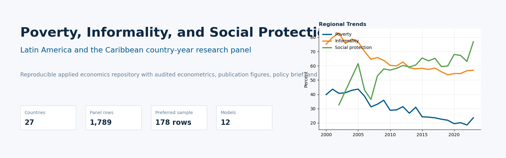

This documentation site summarizes the repository workflow, empirical strategy, dashboard, and publication assets.

## Navigation

- [Reproducibility guide](reproducibility.md)
- [Dashboard documentation](dashboard.md)
- [Repository architecture](repository-architecture.md)
- [Empirical strategy](EMPIRICAL_STRATEGY.md)
- [Econometric diagnostics](ECONOMETRIC_DIAGNOSTICS.md)
- [Data lineage](DATA_LINEAGE.md)
- [Model limitations](MODEL_LIMITATIONS.md)
- [Data license notes](DATA_LICENSE.md)

## Dashboard Preview

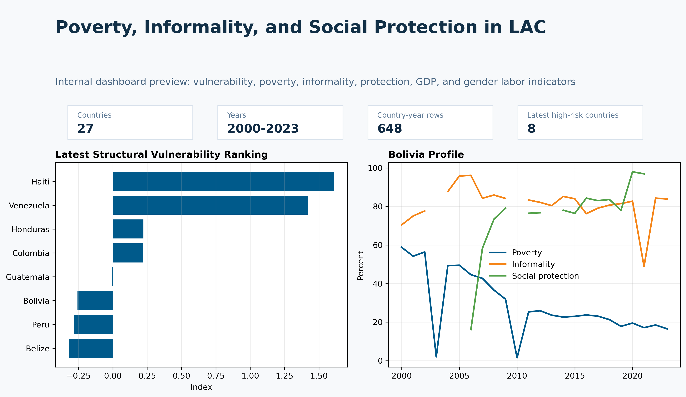

## Research Workflow

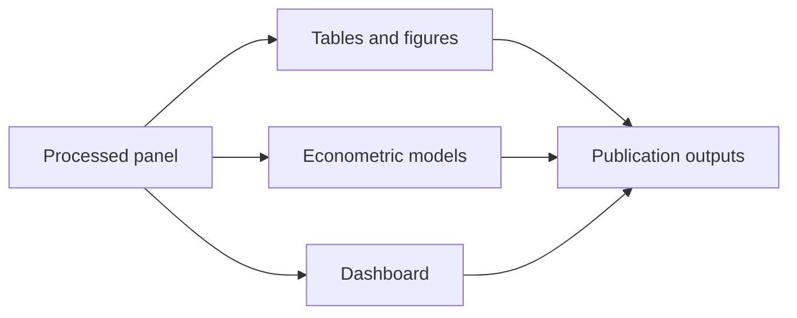

## Publication Figures

| Figure | Preview |
|---|---|
| Figure 1 |  |
| Figure 2 | 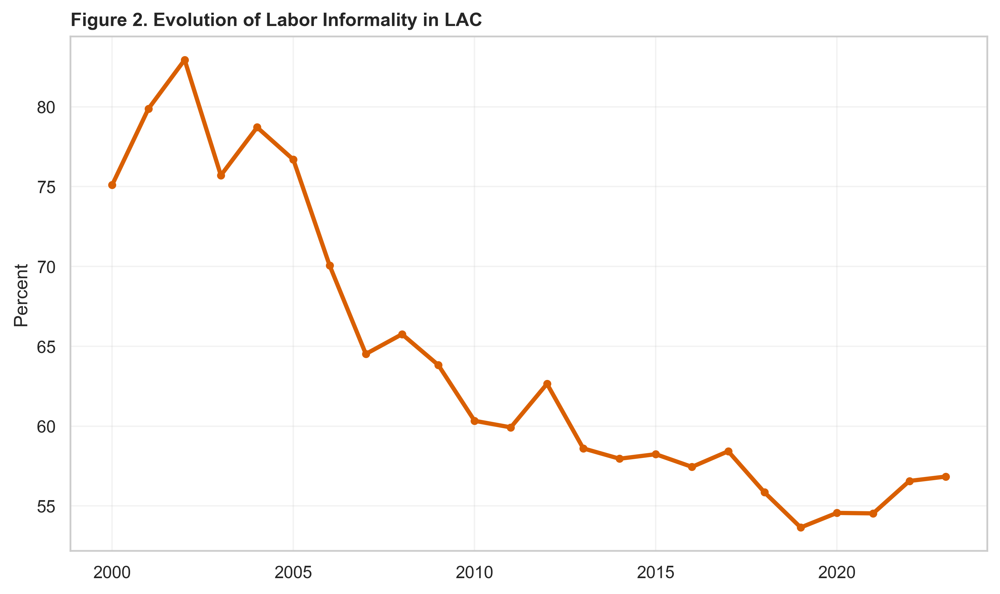 |
| Figure 3 |  |
| Figure 4 | 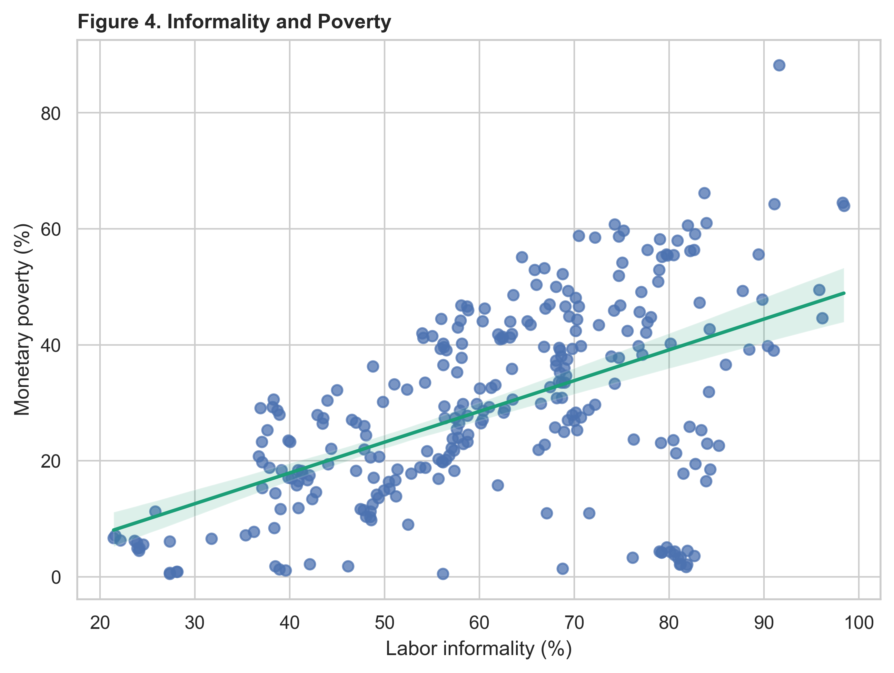 |
| Figure 5 | 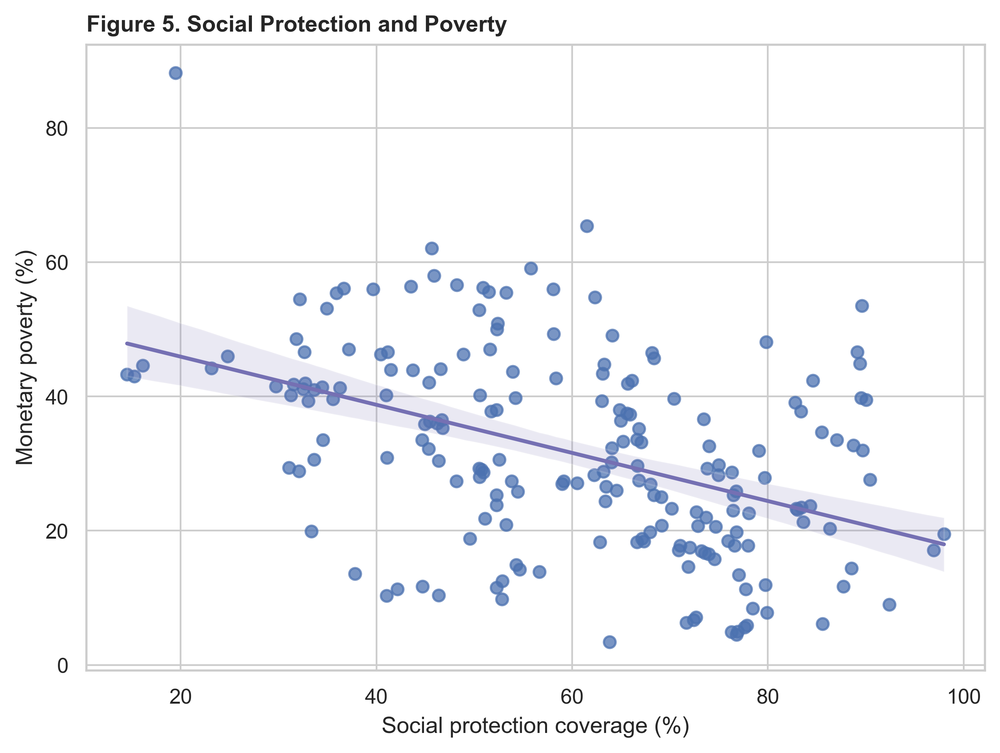 |
| Figure 6 | 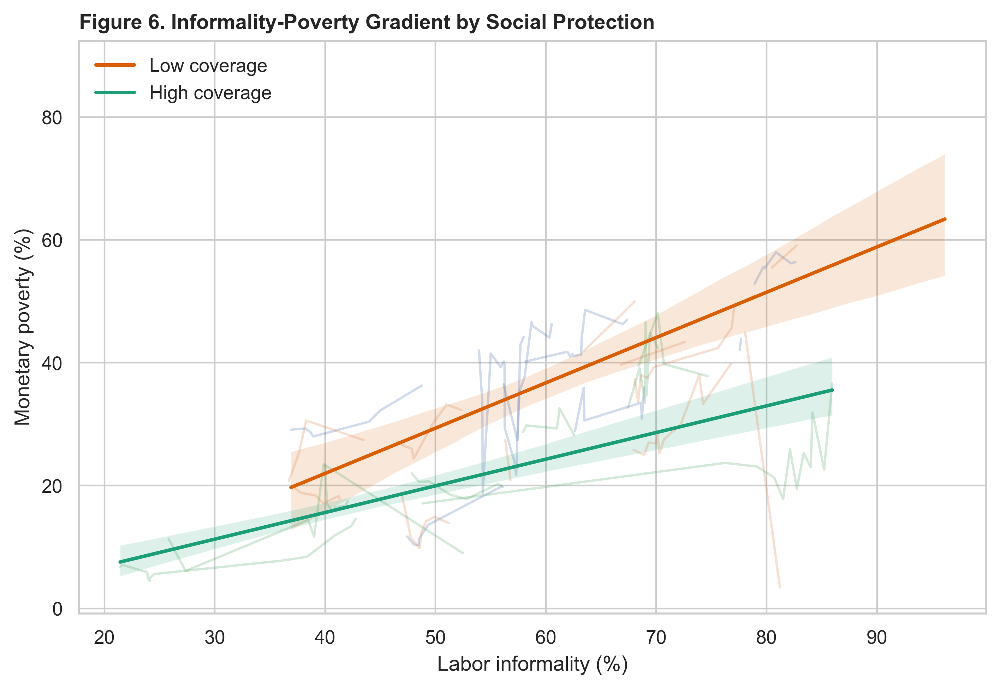 |
| Figure 7 | 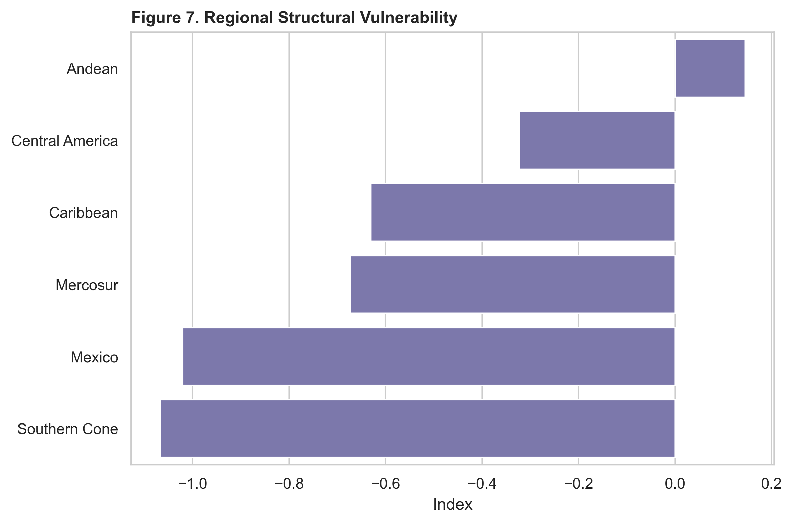 |
| Figure 8 | 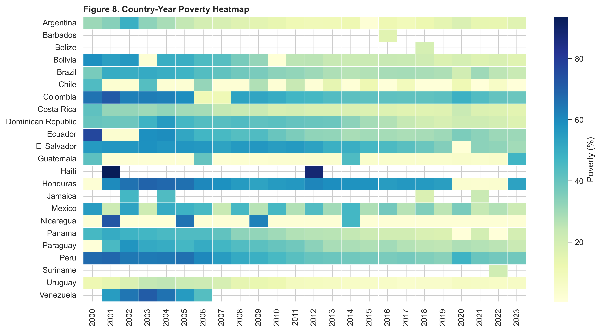 |
| Figure 9 | 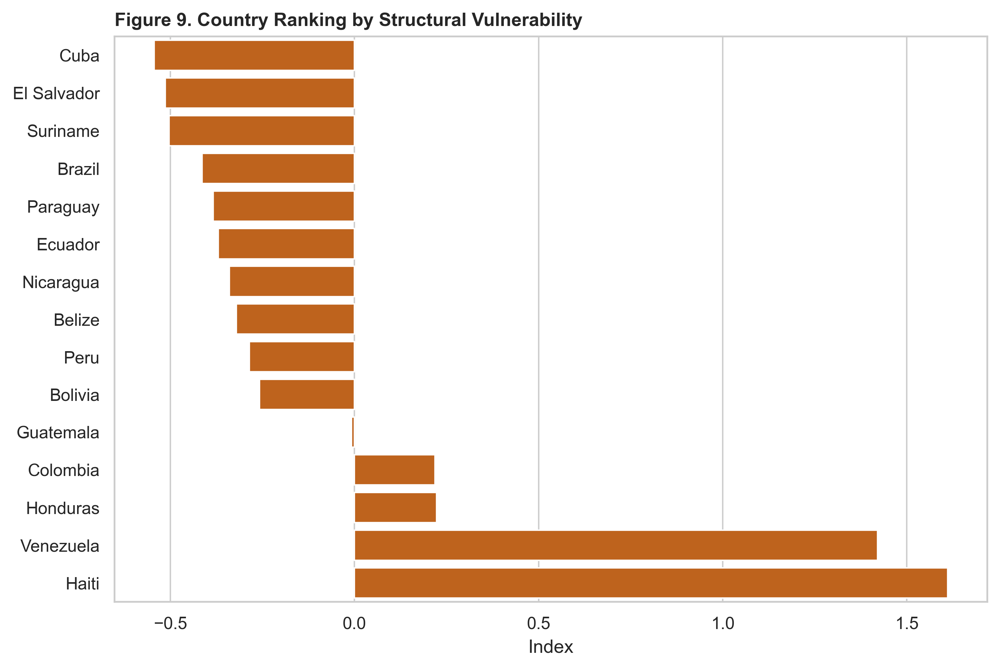 |
| Figure 10 |  |
| Figure 11 | 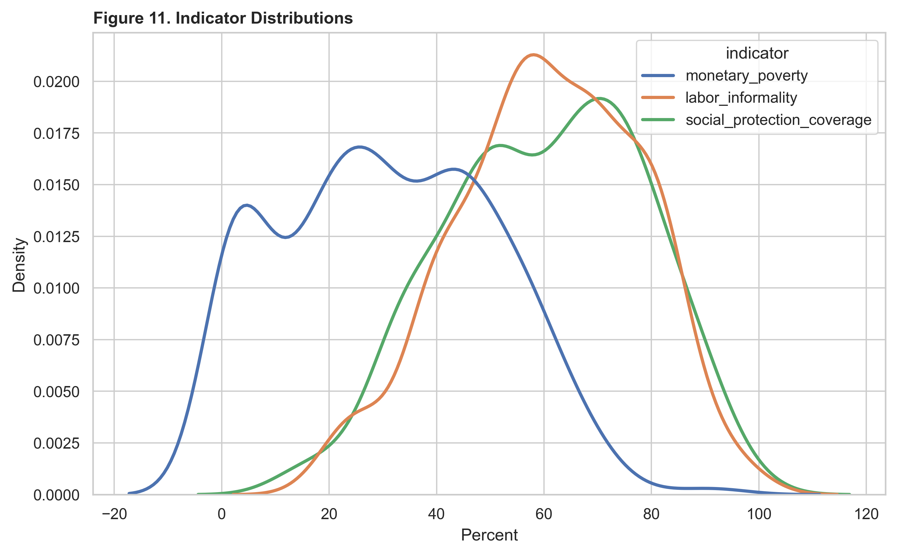 |
| Figure 12 |  |
