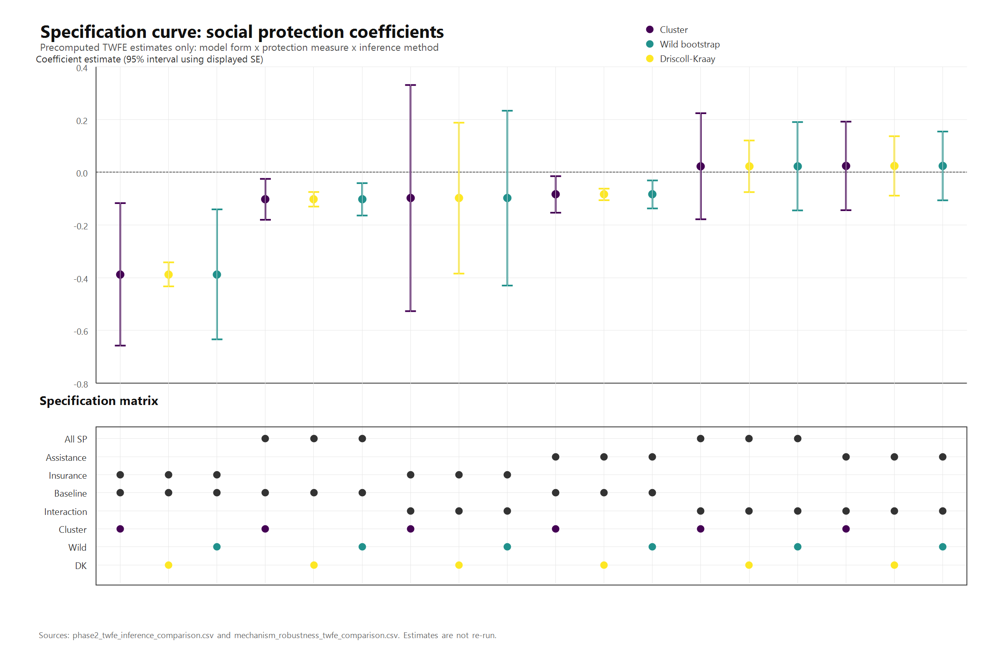
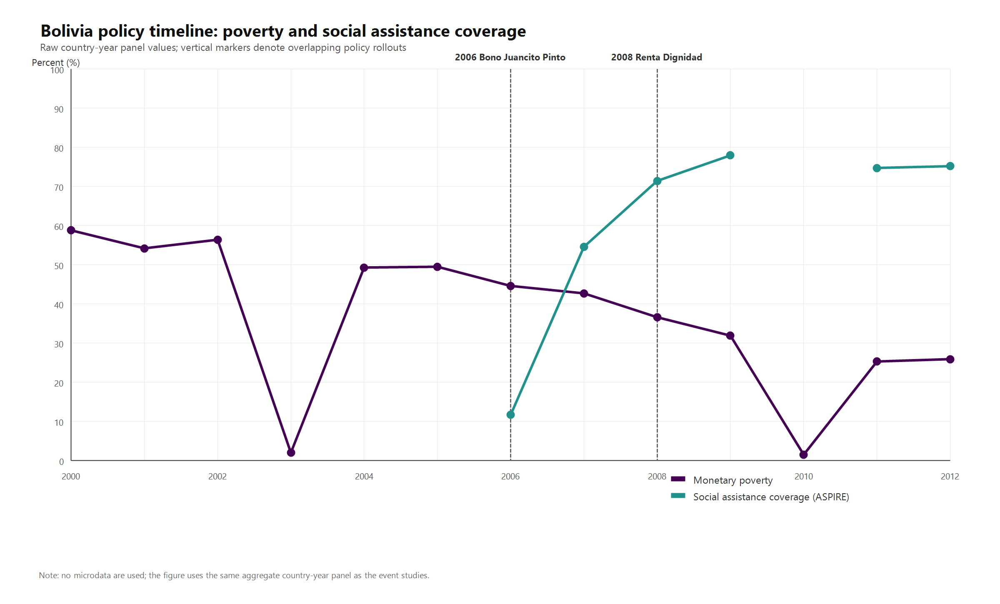

# Labor Informality, Social Protection, and Poverty Dynamics in Latin America

## Abstract

This paper studies whether labor informality and social protection jointly explain poverty dynamics in Latin America and the Caribbean. The project begins with a recursive inventory of local development-economics data archives and then constructs a harmonized country-year panel from ASPIRE, Equity Lab, ILOSTAT, WDI, World Bank Gini, CEPAL, and SEDLAC outputs. The preferred specification is a two-way fixed-effects model with country and year effects, country-clustered robust standard errors, finite-cluster wild-bootstrap inference, and Driscoll-Kraay standard errors as a cross-sectional-dependence robustness check. Social protection coverage is negatively associated with poverty in the canonical specification (beta = -0.1024; cluster p = 0.0206; wild p = 0.0010), while labor informality is positively signed but not robustly significant after finite-cluster inference. The interaction between informality and social protection is negative but fragile. Component-level mechanism checks show that social assistance and social insurance cannot be cleanly isolated with the current country-year panel because both channels expand in correlated institutional packages. Event-study extensions for Bolivia and Peru are treated as exploratory: Bolivia's event-year poverty result is suggestive but not robust at the conventional 5 percent level, and Peru's informality estimates lose 5 percent significance in the canonical specification.

## Introduction

Labor informality is a defining feature of Latin American labor markets. It limits access to contributory social insurance, weakens tax capacity, increases income volatility, and exposes households to shocks. Social protection systems can offset some of these vulnerabilities when programs reach informal workers and provide adequate benefits. The central research question is whether social protection mitigates the poverty risks associated with informality.

## Literature Review

The analysis sits at the intersection of poverty dynamics, labor informality, social protection, and state capacity. The policy literature emphasizes that informality can be both an employment condition and a channel of exclusion from formal insurance. Social protection can partly close this gap through social assistance, pensions, cash transfers, and non-contributory coverage. However, social protection is also endogenous: governments expand programs in response to poverty, politics, crises, fiscal capacity, and institutional constraints.

## Data

The repository inventories 3,411 structured files, 323,659 variables, 541 documentation or script assets, and 96 source collections. The harmonized panel contains 1,789 country-year rows across 27 LAC countries. The preferred complete estimation sample contains 178 observations from 17 countries over 2006-2023.

The core variables are monetary poverty, extreme poverty, labor informality, social protection coverage, gender labor-force participation, unemployment, youth unemployment, employment, GDP per capita, Gini, social expenditure, education expenditure, health expenditure, population, and a structural vulnerability index. Social protection coverage is treated primarily as a combined architecture-wide measure. The component variables for social assistance and social insurance are used only as a robustness and mechanism check, not as separate causal channels.

## Methodology

The preferred Level 1 model is a two-way fixed-effects panel specification. Country effects absorb time-invariant institutional and structural differences; year effects absorb common macroeconomic and regional shocks. Robust inference is required because diagnostics detect heteroskedasticity, serial correlation, and cross-sectional dependence. The canonical Phase 2 workflow therefore reports country-clustered standard errors, wild-cluster-bootstrap p-values for finite-cluster inference, Driscoll-Kraay standard errors, Oster-style sensitivity checks, and residualized panel quantile regressions. A targeted mechanism check replaces the combined protection variable with social assistance and social insurance components, first separately and then jointly with informality interactions.

Level 2 is an exploratory event-study layer for policy episodes with documented timing and sufficient observed pre/post windows in the cleaned panel. Bolivia's 2008 Renta Dignidad expansion and Peru's 2005 JUNTOS rollout are reported as core cases. Bolivia's pre-period is explicitly not policy-empty because Bono Juancito Pinto was established by Decreto Supremo 28899 on October 26, 2006, before Renta Dignidad. Brazil's Bolsa Familia window is retained only as a poverty extension, not as evidence about informality or social-protection mechanisms.

Dynamic GMM is estimated elsewhere in the repository but treated as robustness only because the current complete sample is small and the GMM weighting matrices are singular.

## Results

In the canonical TWFE model, social protection coverage is negatively associated with monetary poverty: beta = -0.1024, country-clustered SE = 0.0396, cluster p = 0.0206, wild-cluster-bootstrap p = 0.0010, and Driscoll-Kraay SE = 0.0142. This is an associational result, not a causal estimate. Labor informality is positively signed (beta = 0.0888), but it is not statistically decisive under country-clustered inference (p = 0.2832) or wild-bootstrap inference (p = 0.1110).

The interaction coefficient between labor informality and social protection coverage is negative (beta = -0.0019), consistent with a mitigation hypothesis, but it is fragile: the cluster p-value is 0.2315 and the wild-bootstrap p-value is 0.5470. Driscoll-Kraay inference yields p = 0.0272 for the interaction, so the result should be described as suggestive rather than conclusive.

Oster sensitivity is stronger for the social-protection main coefficient than for the interaction. The delta required to move the social-protection coefficient to zero is 1.8013, while the interaction delta is 0.5275. Residualized panel quantile regressions show consistently negative social-protection coefficients across the 10th, 25th, 50th, 75th, and 90th percentiles. Informality becomes most visible in the upper poverty quantiles, with the 90th percentile estimate positive and statistically significant.

The mechanism decomposition does not support a clean contributory versus non-contributory interpretation. In the analytic sample, social assistance has greater absolute dispersion than social insurance, and the insurance component loses Haiti 2012, reducing the joint component sample to 177 observations and 16 country clusters. When social assistance and social insurance enter the TWFE interaction model together, neither component nor either interaction is robustly significant at the 5 percent level under country-clustered or wild-bootstrap inference. This is best read as evidence that social-assistance and social-insurance coverage expand through correlated institutional architectures rather than as independent channels that can be isolated with this panel.

Figure 17 reorganizes the already-estimated Level 1 models into a specification curve. The main negative social-protection association is stable in the baseline all-SP specification, while interaction and component specifications show wider uncertainty and greater sensitivity to the inference method.

The robustness dashboard in [HTML](../outputs/tables/phase3_table_3_robustness_dashboard.html) and [LaTeX](../outputs/tables/phase3_table_3_robustness_dashboard.tex) summarizes the same pattern with color-coded inference cells. It makes the mechanism limitation explicit: component estimates can look strong when entered separately, but lose robust 5 percent support under cluster and wild-bootstrap inference once assistance and insurance enter jointly.

In Bolivia, the event-year estimate for monetary poverty around the 2008 Renta Dignidad expansion is suggestive but not robust at the conventional 5 percent level (beta = -2.4707, p = 0.0677). Later post-event poverty coefficients are negative and statistically significant, but the evidence remains small-sample and event-specific. Bolivia's informality coefficients are not statistically significant after the event. Historical sequencing also matters: Bono Juancito Pinto was established by Decreto Supremo 28899 on October 26, 2006, before the 2008 Renta Dignidad expansion, so the Renta Dignidad pre-period is partly confounded by a prior social-policy rollout.

In Peru, the 2005 JUNTOS event-study shows a positive event-year monetary-poverty coefficient and later negative but imprecise poverty estimates. The labor-informality post-event coefficients lose 5 percent significance in the canonical specification; they are positive and mostly marginal at the 10 percent level. These estimates are reported as fragile findings, not as robust causal evidence.

## Discussion

The evidence supports a structural vulnerability interpretation. Informality, inequality, unemployment, and weak macroeconomic conditions are connected to poverty risk, while social protection coverage is a protective correlate. The panel results are strongest for the conditional association between social protection and poverty. The interaction, component-mechanism, and event-study results are more fragile, which is substantively important rather than a defect to hide: the current country-year panel can discipline hypotheses, but it cannot replace household microdata, administrative rollout information, or richer quasi-experimental designs.

## Bolivia Profile

Bolivia is treated as a special analytical case because the aggregate country-year panel contains a documented sequence of social-policy expansions around the event-study window. Under the current scope, Phase 4 is restricted to the same aggregate panel used in the event studies; no household microdata are searched, integrated, or interpreted.

Figure 18 places the Bolivia event-study in historical sequence. The 2006 Bono Juancito Pinto rollout precedes the 2008 Renta Dignidad expansion, so the pre-period should be read as an overlapping policy environment rather than as a clean untreated baseline.

## Policy Implications

1. Expand social protection coverage for informal workers.
2. Strengthen benefit adequacy, not only nominal coverage.
3. Link social protection to labor-market services and formalization pathways.
4. Use structural vulnerability rankings to monitor country risk.
5. Validate aggregate results with household microdata before drawing country-specific causal conclusions.

## Limitations

The Level 1 analysis is associational. The panel is unbalanced, the main model has 17 country clusters, social protection is endogenous, and policy timing is observed at a coarse country-year level. Wild-bootstrap inference and Driscoll-Kraay standard errors improve transparency but do not solve identification. The social assistance and social insurance components are collinear enough in practice that the current panel cannot isolate contributory and non-contributory mechanisms once both enter jointly with informality interactions. The Bolivia and Peru event studies are exploratory and sensitive to small event windows, missing observations, and pre-trend limitations; Bolivia is further limited by the 2006 Bono Juancito Pinto rollout before Renta Dignidad. Dynamic GMM is fragile in the current sample and should not anchor the paper's conclusions.

## Conclusions

The repository demonstrates a full research pipeline from data inventory to reproducible analysis, diagnostics, visualization, dashboarding, and policy communication. The central policy conclusion is that poverty, informality, and social protection should be analyzed jointly, especially in Bolivia and other structurally vulnerable economies. The strongest empirical finding is an observational negative association between social protection coverage and poverty; the causal interpretation remains a task for the next research layer.

## References

See `paper/references.bib` for data-source and literature references.
